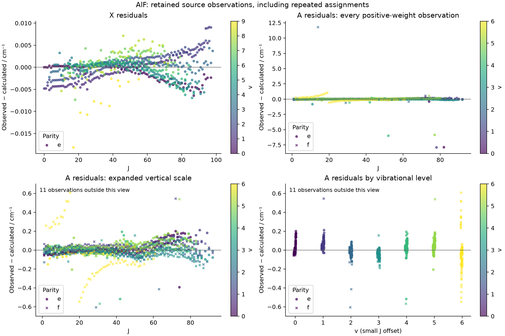
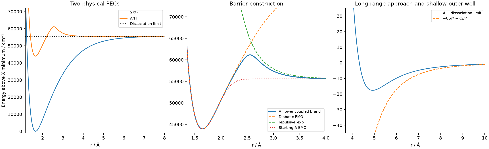
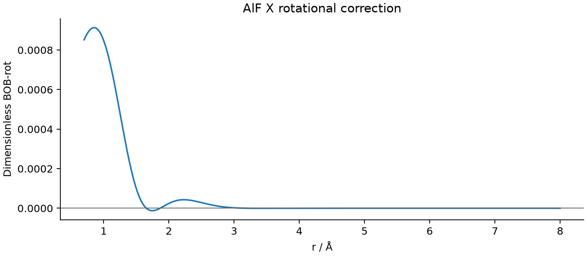

# AlF two-state barrier-potential refinement

The selected model contains **X1Sigma+ and A1Pi only**, preserving the supplied AlF symmetries. The A PEC uses `type coupled-pec`, `sub-types EMO repulsive_exp EMO`, and `COMPON 1`. PL = PR = 6 in every EMO sub-function. It is numerically validated on the supplied levels; experimental discrepancies and the theoretical tail still need scientific review.

- [Selected robust Duo input](refined_model/27AlF_X_A_coupled_pec.inp)
- [Ordinary least-squares alternative](refined_model/27AlF_X_A_ordinary_fit.inp)
- [Automatic pipeline and commands](refine_tools/README.md)
- [Literature, units and physical assumptions](LITERATURE.md)
- [Residuals for every retained source record](diagnostics/all_original_observation_residuals.csv)

## Fit quality

All values below are in cm-1. The comparisons use the same **1,828 positive-weight original observations**, including all six duplicate pairs. The original twelve zero-weight levels are retained and reported separately. No large residual was removed from these statistics.

| Model | X RMS | A RMS | All-data RMS | A median absolute residual | A 95th percentile |
|---|---:|---:|---:|---:|---:|
| Repaired source input, original PEC/BOB values | 31.86128746 | 0.59627842 | 20.15338575 | 0.15035130 | 0.43001853 |
| New barrier seed, copied BOB removed | 0.14053040 | 0.64669636 | 0.50879546 | 0.20372844 | 0.74311639 |
| Ordinary least-squares alternative | 0.00735396 | 0.58106575 | 0.45015665 | 0.05768343 | 0.28774533 |
| Selected robust model | 0.00267157 | 0.58249602 | 0.45124378 | 0.03467448 | 0.17505570 |

The source input could not execute as supplied because its Lx `MORPHING` had no underlying ab initio field. The first row therefore uses the documented runnable repair, the correct singlet-Pi assignments, and the full observed J range. It is not an untouched-source Duo result. Much of the large ground-state improvement comes from replacing the AlCl-centred rotational correction, rather than from changing the A potential.

Within the requested barrier form, the all-data RMS decreases from 0.508795 to 0.451244. The robust model has a slightly larger all-data RMS than the ordinary alternative, but smaller typical residuals and a better X fit. The supplied `Robust 0.00001` is used for the selected refinement. No statistical uncertainty is inferred from these calibration residuals; the supplied nonzero weights are all one.

## Physical curves

X has one smooth well and a fixed limit of 55564.02471 cm-1. A has a smooth inner well, a barrier at approximately **2.5542 Angstrom**, **5590.9 cm-1 above dissociation**, and a shallow outer minimum near 4.924 Angstrom, 17.66 cm-1 below the limit. The final barrier differs modestly from the literature initialization target; the observed v = 0–6 levels do not uniquely determine its height.

The A tail retains B5 = -73495.9702828864 cm-1 Angstrom^5 and B6 = -362561.9198027829 cm-1 Angstrom^6. These are fixed, converted AlF estimates, not CH coefficients. The positive repulsive term uses gamma = 8, so it does not replace the leading attractive tail at large distance. The outer well is the smooth transition from the barrier to that attractive tail, not an additional oscillation in the fitted region.

X uses beta coefficients B0–B8, while the inner A EMO uses B0–B6. The diabatic upper limit, repulsive branch, and EMO coupling parameters were fixed after initialization. The X rotational BOB correction was re-centred on AlF and fitted with B0 fixed at zero to reduce its correlation with RE. Its maximum absolute value over the checked range is 0.000913257. The existing X–A angular-momentum function was fitted with one amplitude parameter; no third electronic state was introduced.

## Input audit and remaining discrepancies

The [complete audit](diagnostics/input_audit.json) retains every changed or consolidated record:

- Eleven nonbreaking spaces in the dipole grid were normalized.
- The unsupported Lx morphing flag was removed; the existing constant-one analytic Lx was used as the initial assumption and subsequently refined.
- A-state Omega was corrected from 0 to -1, consistent with the supplied Lambda = -1 and Sigma = 0. Total parities and vibrational labels were preserved.
- Two records with negative J and negative energy were already inactive under Duo's JLIST. They remain in the untouched reference input and audit; they were not converted into new observations.
- JLIST was extended from 92 to 98 to include twenty supplied X-state levels.
- Six repeated physical assignments have conflicting energies. They were consolidated to weighted means with summed weights for Duo, preventing assignment cascades. Final statistics expand them back into their original records. Their parities were not guessed or silently corrected. Robust fitting of means differs from robust fitting of the separate records.

The following seven positive-weight A levels have residual magnitude greater than 1 cm-1; six exceed 5 cm-1:

| v | J | Total parity | Observed energy | Observed − calculated |
|---:|---:|:---:|---:|---:|
| 2 | 14 | - | 45646.12940 | +11.785176 |
| 1 | 78 | + | 48070.82940 | -7.906499 |
| 0 | 82 | + | 47660.63940 | -7.879164 |
| 4 | 52 | + | 48491.25940 | -5.999385 |
| 5 | 77 | - | 50891.93940 | -5.855004 |
| 0 | 8 | + | 43984.06940 | -5.048077 |
| 6 | 19 | + | 48706.24940 | +1.057560 |

The A, v = 6 residuals also show a localized change around J = 19–20. Such structure and the isolated discrepancies require examination of the source energies/parities and perturbations. A two-state X/A Hamiltonian cannot explicitly represent the known A–b triplet interaction. The supplied data do not establish which discrepancy is a transcription error or a physical perturbation. Both possibilities remain open.

## Numerical and implementation checks

All 1,834 consolidated rows (1,822 positive-weight rows) match the requested state, v, Lambda, Sigma, Omega and parity in the selected calculation. The expanded table contains the original 1,840 active-J records. Native high-precision energies are used, rather than the rounded four-decimal fitting table.

| Check | Largest change in a positive-weight energy / cm-1 |
|---|---:|
| 601 to 801 radial points | 2.183e-10 |
| vmax 60 to 90 per electronic state | 9.934e-09 |
| 1001 points, rmax 8 Angstrom, vmax 100 | 2.564e-09 |

The selected input uses the final 1001-point grid and vmax 100 for both states. No observed level is above dissociation. These checks validate the supplied bound-state energies; they do not establish resonance widths or high-v predictions near the barrier.

Independent curve evaluation agrees with native Duo to below 7e-8 cm-1 over the final radial grid, including the short-range wall. Shape checks cover 0.7–1000 Angstrom. Five scientific tests passed, covering the lower eigenvalue branch, inverse-power sign/unit conversion, robust weights, positional transfer of repeated parameter names, and weighted duplicate equivalence. A reduced complete pipeline run from the untouched source input also passed preparation, both fitting stages, all numerical checks, curve comparison and report generation; see `diagnostics/pipeline_smoke_result.json`.

`diagnostics/provenance.json` records original-file and executable hashes. Per-stage manifests and histories are in `diagnostics/stages/`. Selected native stdout and high-precision energy files are retained locally under `pecfit_runs/20260919/`; the full exploration is in the workspace AlF_refinement directory. The original supplied files are unchanged. The inherited dipole functions have not been fitted or validated by this energy-only calculation.
