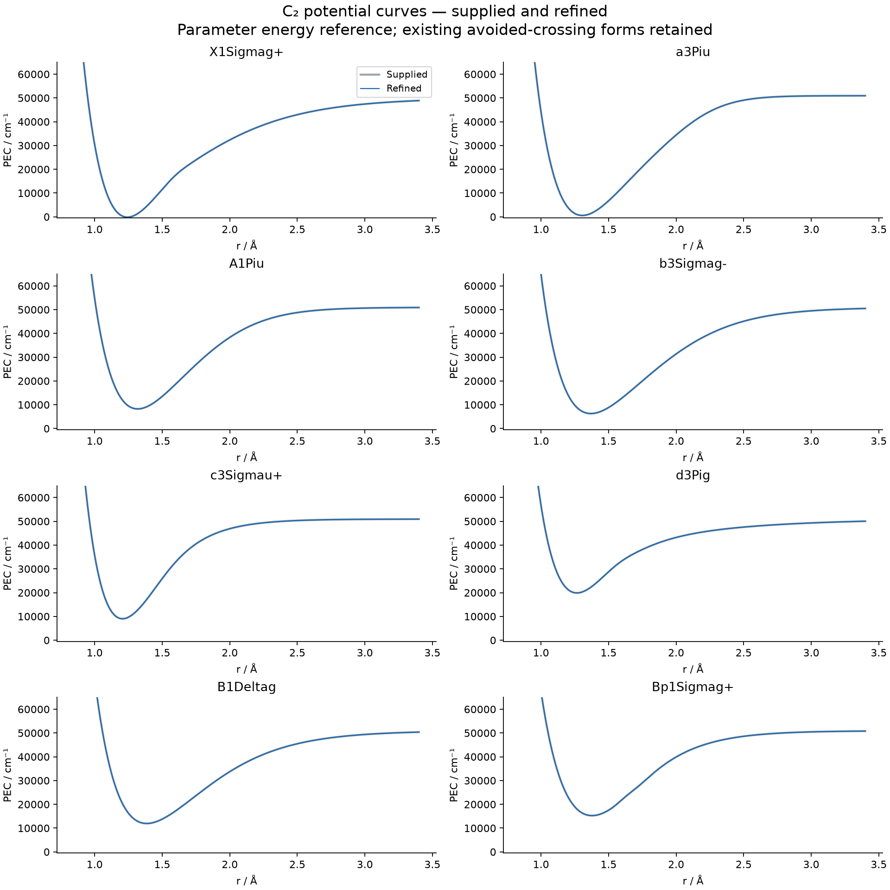
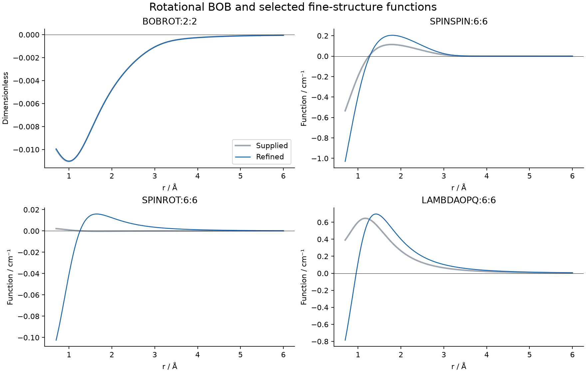
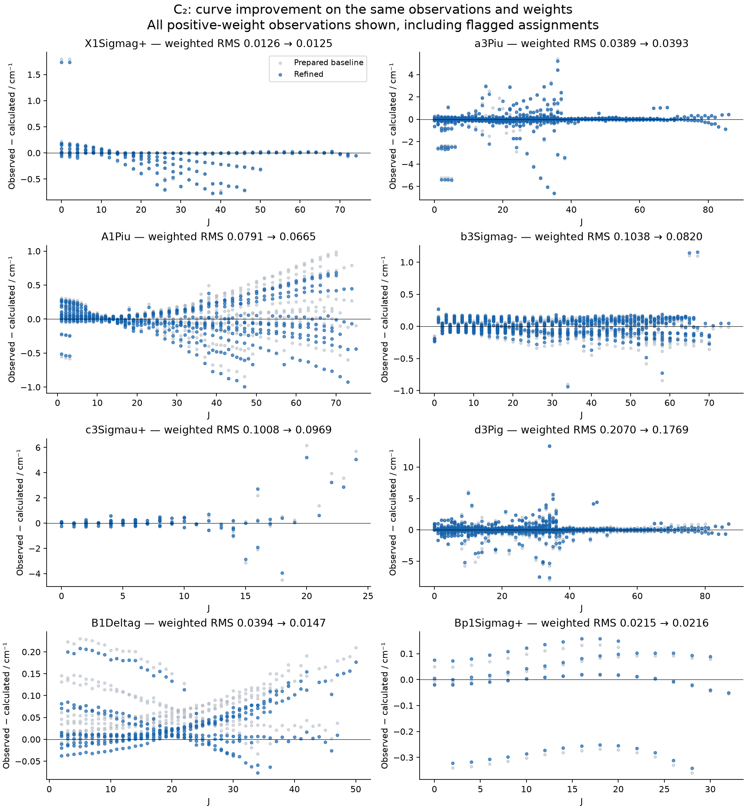

# C2 eight-state curve refinement

The best accepted trial improves the fixed-input-weight RMS from
**0.090912 to 0.077912 cm-1**
(14.3%) on the same prepared set of
**4729 positive-weight levels through J=87**.
Unweighted RMS changes from 0.622184 to 0.593890 cm-1.
On the original J<=35 domain, using the same corrected data, weighted RMS
improves from 0.064653 to
0.048734 cm-1 (3519 positive-weight levels).
This is a modest curve improvement, separate from the much larger effect of
fixing input matching problems. It is not a globally optimal or fully certified
eight-state spectroscopic model. Status remains **needs_review**.

## Fair comparison

| Calculation | Positive-weight records | Weighted RMS / cm-1 | RMS / cm-1 |
|---|---:|---:|---:|
| As supplied, J≤35 | 3520 | 0.335828 | 7.246298 |
| As supplied, J≤87 | 4730 | 7.164993 | 16.727295 |
| Relaxed Ω matching, unchanged curves | 4730 | 0.173911 | 0.993584 |
| Duplicate corrected, unchanged curves | 4729 | 0.090912 | 0.622184 |
| Refined, original numerical basis | 4729 | 0.077913 | 0.593907 |
| Refined, final numerical basis | 4729 | 0.077912 | 0.593890 |

The supplied file uses `itmax 0`, `JLIST 0-35`, `Robust 0.00001`, a 7 cm-1
residual cutoff and positive `lock 90`. It contains observations through J=87.
The strict labels cause several high-J d-state fine-structure components to
match the wrong calculated branch. Testing `lock -7` keeps state and v, but
allows approximate Lambda/Sigma/Omega labels to differ within 7 cm-1. This is
an explicit, provisional assignment policy; all changed labels are exposed in
[assignment_review.csv](refined_model/assignment_review.csv). They have not been
independently validated against measured transitions or eigenvector overlaps.

There are also two entries for the same b-state J=9, +, v=5 level at
13393.93880 and 13393.93920 cm-1. Duo forces them onto different level indices,
producing a false 53 cm-1 residual. The working input combines their weights
(0.01 + 1.44) and uses the weighted mean energy. Both original records remain
in [source_input.inp](source_input.inp) and [preparation.json](preparation.json).
This explains the count changing from 4730 observations to 4729 levels; it is
not an outlier deletion. The 61 known-state zero-weight records and eight
inactive state-22 placeholders retain their original status. No supplied file
was overwritten and no experimental energy was otherwise altered.

## Curve changes and safeguards

All eight PECs retain their supplied EMO or TWO_COUPLED_EMOS forms. The initial
89-parameter native refinement also adjusts the existing coupling and
fine-structure functions. A later, separately labelled `Robust=0` polish fixes
the principal spin-orbit and L+ morphing functions and adds c-state B3 to the
fit, leaving 75 active parameters. It changes values rather than replacing
the supplied eight-state Hamiltonian or inventing new electronic states.

The initial derivatives used J=0-35; later proposals used
0,1,2,5,10,15,20,25,30,35,40,50,60,70,80,87 to reduce computational cost.
Every accepted proposal was then calculated afresh on the complete J=0-87
range. The final original-basis weighted RMS is 0.077913 cm-1. Further proposals
that introduced new assignment failures were rejected, including ones with
apparently acceptable weighted statistics.

Shape checks cover 0.7-6 Angstrom and preserve the initial PEC extrema and
avoided-crossing structure. They also bound repulsive walls, changes in the
observed-energy region, BOB magnitude, and fine-structure magnitudes/slopes.
SOC/L+ morphing factors are bounded relative to the supplied functions. These
are conservative diagnostics, not a substitute for electronic-structure
validation. The analytic PEC diagnostic routines agree with native Duo's
rounded ab initio curve tables to within their printed precision (about
0.006 cm-1). Dipole functions, linked parameters, symmetry conventions and
ab initio observations remain in the input.

## Residuals by state

| State | Positive-weight levels | Baseline weighted RMS / cm-1 | Refined weighted RMS / cm-1 |
|---|---:|---:|---:|
| X1Sigmag+ | 183 | 0.012585 | 0.012459 |
| a3Piu | 1426 | 0.038851 | 0.039283 |
| A1Piu | 532 | 0.079124 | 0.066472 |
| b3Sigmag- | 756 | 0.103810 | 0.081976 |
| c3Sigmau+ | 110 | 0.100761 | 0.096945 |
| d3Pig | 1342 | 0.207026 | 0.176885 |
| B1Deltag | 322 | 0.039369 | 0.014713 |
| Bp1Sigmag+ | 58 | 0.021527 | 0.021583 |

There remain **3 positive-weight observations with native
assignment flags**, including **1 state/v mismatch**.
The largest positive-weight residual is 13.318412 cm-1.
All are retained in the reported residuals and fixed-weight RMS, even when the
native fitter's 7 cm-1 cutoff removes them from its least-squares step. Approximate
Omega-label differences and zero-weight flags are also retained for inspection.
Further accuracy work should resolve these assignments before interpreting
their residuals as defects in the curves.

## Numerical validation

The supplied calculation uses 401 grid points over 0.85-4 Angstrom and
vmax = 60,30,30,30,40,40,30,30. Increasing this basis shifts some d-state levels
by around 0.01 cm-1. The delivered input uses the final expanded grid and
contractions recorded directly in its GRID and CONTRACTION blocks.

The last two checks (final_basis601 and final_basis701) differ by at most
**0.00204274 cm-1** over positive-weight observations;
their fixed-weight RMS difference is **0.00001184 cm-1**.
Convergence to 0.0001 cm-1 for every such level:
**not established**.
The change in the overall weighted fit statistic is small, but no tighter
per-level numerical accuracy is claimed. Final term energies use native Duo's
12-decimal output, not rounded log-table values.

A further 901-point check exceeded the execution limit during the final
standalone calculation. It is retained as an incomplete diagnostic and was
not used to certify the delivered 701-point result.

These checks establish the observed improvement and its practical numerical
limits. They do not establish measurement uncertainties, out-of-sample accuracy
or isotope transferability.

## Delivered files and reproduction

* [Recommended expanded-basis Duo input](refined_model/C2_refined.inp)
* [Faster original-basis input](refined_model/C2_refined_fast.inp)
* [Parameters, including positional indices](refined_model/parameters.json)
* [All calculated residuals](refined_model/residuals.csv)
* [Basis convergence](refined_model/basis_convergence.csv)
* [Machine-readable summary](refined_model/summary.json)
* [Reusable native refinement tools and commands](refine_tools/README.md)

The final input was executed with the local native Duo binary whose SHA-256 is
in `refined_model/native_manifest.json`. Source and deliverable hashes are saved.
Key native calculations are retained under `pecfit_runs/c2_refinement`; the
complete exploratory logs remain at `C:\Users\Sergey\Documents\ChatGPT\Duo\C2_refinement\runs`.
Ten focused regression tests pass. The automatic loop was exercised with actual
eight-state Duo proposals, including rejection of assignment-damaging steps.
No commit or push was performed.
