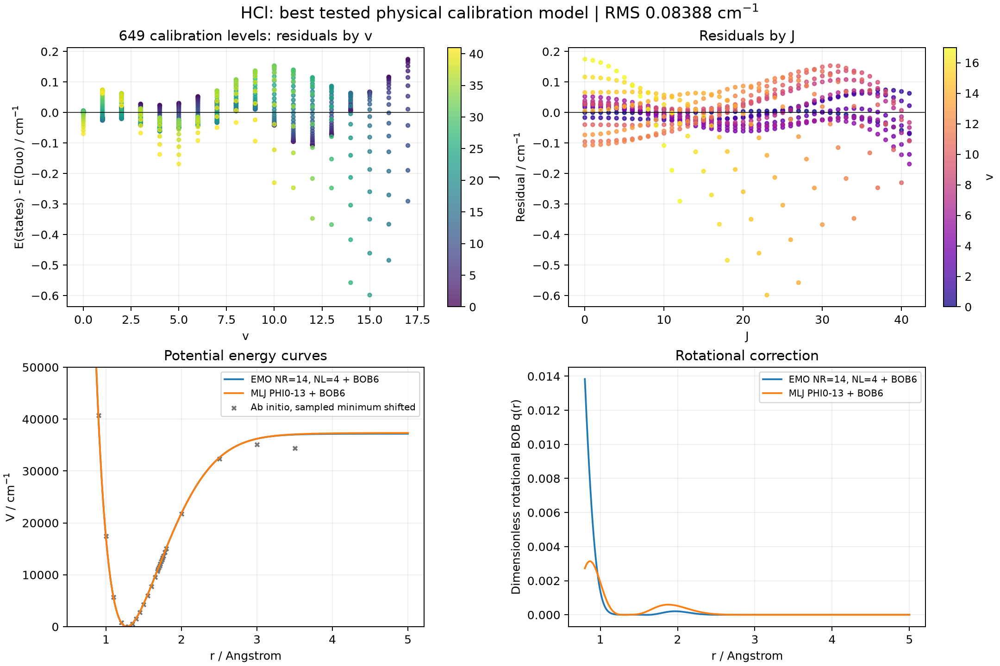
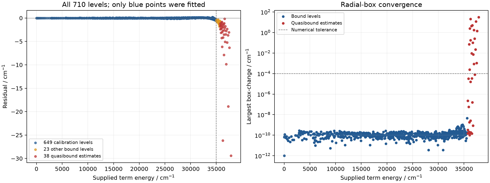

# HCl potential and rotational BOB refinement

The best **tested physical model for the common calibration domain** is EMO
with PL=PR=2, NL=4, NR=14 and a `polynom_decay_24` rotational BOB expansion
through B6. Its RMS is **0.08387542 cm-1** and its
fixed-input-weight RMS is **0.06363345 cm-1**
on **649 levels with supplied energy <=35000 cm-1**, covering J=0--41 and v=0--17.
The largest calibration residual is 0.598306 cm-1.
This is the best result of the tested searches, not a proof of a global optimum.

**A high-accuracy fit of all 710 supplied levels was not achieved.** Every level
remains in the diagnostic output. For the selected model, 38 levels lie above
its dissociation limit and are represented by localized finite-box estimates.
All-level RMS is 1.835907 cm-1 and the largest radial-box
change is 30.667358 cm-1. The run correctly retains
`needs_review`. The 23 additional bound levels above the calibration cutoff
were not fitted in this comparison; the RMS over all 672
bound levels is 0.186578 cm-1.

## Comparison on identical evaluation data

Weights remain `100/sqrt(v+1)/sqrt(J+1)`. The initial refinements used
`Robust=0.0001`; the separately labelled polishing runs use Robust=0. The
table compares the same 649-level subset and also reports every model on all
710 source energies. Early trials were fitted to all available levels; the
physical calibration trials explicitly used the <=35000 cm-1 cutoff.

| Model | Common-subset RMS / cm-1 | Common-subset weighted RMS / cm-1 | All-710 RMS / cm-1 |
|---|---:|---:|---:|
| emo10 | 5.057478 | 4.246548 | 12.206723 |
| emo10_bob3 | 4.466488 | 3.750959 | 12.233956 |
| physical_emo14_bob6 | 0.108853 | 0.074796 | 1.694221 |
| physical_emo14_polish | 0.083875 | 0.063633 | 1.835907 |
| physical_mlj13_polish | 0.083723 | 0.068996 | 2.074768 |

The requested NR=10 model was tested with B9=B10=0 initially, including the
missing B10 value. Larger right-hand expansions, alternate radial powers,
MLJ through PHI13, and BOB through B8 were explored. Some lower residuals were
rejected because they produced extra centrifugal wells, excessive repulsive
walls, or failed numerical validation. These diagnostics and incomplete trial
checkpoints remain under `pecfit_runs/`; they are not recommended models.



## Numerical and shape checks

* Single-well PEC and sensible centrifugal topology for every J=0--41 on
  0.5--12 Angstrom; at most one centrifugal barrier.
* Positive EMO asymptotic exponent and zero BOB asymptote. BOB limits are
  |q|<=0.05, |dq/dr|<=0.2 per Angstrom, at most four significant reversals;
  excursions below 1e-6 are ignored only when counting reversals.
* A broad 1e8 cm-1 ceiling on the repulsive wall excludes pathological
  extrapolations. Monotonicity alone had allowed walls as large as 1e31 cm-1,
  which also spoiled double-precision eigenvalues when extending the grid.
* The selected calibration levels change by at most
  **1.03e-09 cm-1** on the tested expanded boxes.
  The final primitive-grid and native-Duo energies agree within
  1.5e-08 cm-1. The delivered bound input was rerun;
  its maximum difference is 0 cm-1.
* All 672 bound levels pass the numerical box test.
  This tests numerical stability, not accuracy on independent experimental data.

The optional refiner labels a localized state by its inner-well node count,
not its ordinal energy rank. A concrete example from the NR=10 diagnostic is
J=40,v=13: when rmax changes from 5 to 6 Angstrom, the localized level moves
from rank 14 to rank 16. Its energy stays near 37864.8 cm-1, while blindly using
rank 14 changes the assigned energy by about 378 cm-1. The inserted lower
states have almost no inner-well probability. The raw native calculations are
in `pecfit_runs/numerical_diagnostics/`.



Quasibound finite-box eigenvalues still depend on box size and avoided crossings
even when the correct localized state is identified. Reliable refinement of
these levels requires a resonance treatment (for example, outgoing-wave
boundary conditions or a validated resonance-capable solver), rather than
letting the PEC or BOB absorb the box dependence. No uncertainties accompany
the supplied states file, so the reported RMS is agreement with those energies,
not a measurement uncertainty or an independent prediction accuracy.

## HCl literature and parameter provenance

[Coxon and Hajigeorgiou (2000)](https://doi.org/10.1006/jmsp.2000.8155)
studied analytic HCl potentials and Born-Oppenheimer-breakdown corrections
using several isotopologues. I could verify the paper and its scope but could
not obtain its complete numerical MLJ parameter table. The KH coefficients
were therefore not treated as HCl parameters.

[Coxon and Hajigeorgiou (2015)](https://doi.org/10.1016/j.jqsrt.2014.08.028)
use **MLR3**, which differs from Duo's **MLJ**, with long-range dispersion and
BOB corrections. Their reported H-35Cl equilibrium separation,
1.27454677 Angstrom, is fixed in the localized comparisons to reduce its
correlation with the BOB constant. The BOB obtained here is an effective
single-isotopologue function; it is not a mass-dependent model for DCl or H-37Cl.

MLJ starting coefficients were constructed numerically from the RKR-style
points reproduced in Table I of
[Olivares-Pilon and Turbiner](https://arxiv.org/abs/2208.07895), which attributes
those points to the 2015 work. The rounded well-depth seed is 37231.89594 cm-1;
the C6 seed is 23.41 atomic units. These are **derived seeds, not a published
MLJ coefficient table**. `models/literature_seed.py` records the construction.
The supplied ab initio file, including its non-monotone final tail points, was
preserved. The earlier EMO ab initio fit and the original HCl inputs are retained.

## Files and reproduction

* [Recommended parameters](refined_model/parameters.json)
* [Duo calculation for the 649-level calibration domain](refined_model/bound_calculation.inp)
* [All-710 diagnostic input](refined_model/all_levels_diagnostic.inp)
* [All-level residuals and physical-v/rank map](refined_model/all_level_residuals.csv)
* [Numerical convergence table](refined_model/basis_convergence.csv)
* [Machine-readable summary](refined_model/summary.json)
* [Complete model comparison](pecfit_runs/comparison/comparison.md)

The all-level input uses audited box ranks. Regenerate it after changing the
potential or grid; its internal v column must not be mistaken for the original
physical v labels. The original states file is never altered.

From the repository root, with Python 3.10+ and a native Duo executable:

```sh
python -m pip install ".[localized,plots]"
python -m pecfit refine-localized HCl/models/physical_emo14_polish.json --duo /path/to/duo --optimizer penalized --robust 0 --fit-below 35000 --max-iterations 150 --output HCl/pecfit_runs/repeat_emo_polish
python -m pecfit refine-localized HCl/models/physical_mlj13_polish.json --duo /path/to/duo --optimizer penalized --robust 0 --preserve-c6 --fit-below 35000 --max-iterations 150 --output HCl/pecfit_runs/repeat_mlj_polish
```

Use the corresponding `physical_*_bob6.json` configurations with
`--robust 0.0001` for the initial robust comparisons. Omit `--fit-below` to test
all source levels, with the documented quasibound limitations. Each localized
run uses a fresh output directory. The core Duo workflow still supports
`--resume`; see [PEC_FITTING.md](../PEC_FITTING.md).

The regression suite contains 48 passing tests, including native Duo
calculations, MLJ/BOB parsing, state coverage, eigenvalue derivatives,
optimizer recovery, repulsive-wall rejection, and separate subset/full-data
selection. No remote commit or push was performed.
